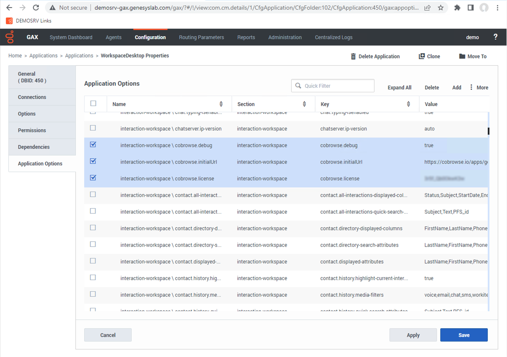
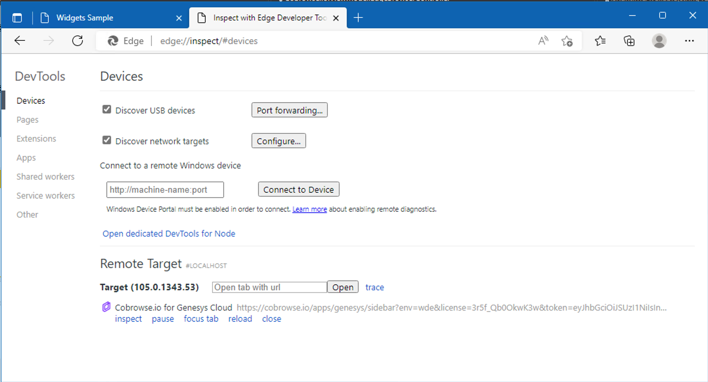

# Engage Workspace Desktop Edition (WDE)

## Installation

Supported WDE versions: 8.5.147.05+.

[WebView2](https://docs.genesys.com/Documentation/IW/8.5.1/Developer/Chromium) installed on your WDE instances.

### 1. Install plugin

Add the plugin and dependencies to your Workspace Desktop Edition installation:

* `Genesyslab.Desktop.Modules.CobrowseIO.dll`
* `Genesyslab.Desktop.Modules.CobrowseIO.module-config`

These files should be added adjacent to your other Module `.dll` files, in the same directory as `InteractionWorkspace.exe`. This executable is most commonly found at`C:\Program Files (x86)\GCTI\Workspace Desktop Edition`.


Cobrowse can provide these files to you upon request, free of charge, in order to conduct a proof-of-concept (PoC) or other technical evaluation.


### 2. Add required config

The configuration values can be added via Genesys GAX, Genesys Administrator, or directly in a `InteractionWorkspace.exe.config` file adjacent to your `InteractionWorkspace.exe`

When using Genesys GAX, please navigate to Environment/Applications -> WorkspaceDesktop -> Application Options -> interaction-workspace and add the following fields there.&#x20;

<table data-header-hidden><thead><tr><th width="270.3333333333333">Field</th><th width="94">Type</th><th>Value</th></tr></thead><tbody><tr><td>Field</td><td>Type</td><td>Value</td></tr><tr><td><strong>cobrowse.api</strong> required</td><td>string</td><td>eg. <code>https://cobrowse.yourcompany.com</code>  default is <code>https://cobrowse.io</code></td></tr><tr><td><strong>cobrowse.license</strong> required</td><td>string</td><td>your license key</td></tr><tr><td><strong>cobrowse.debug</strong> optional</td><td>string</td><td><code>true</code> / <code>false</code>  default is <code>false</code></td></tr><tr><td><strong>cobrowse.initialUrl</strong> optional</td><td>string</td><td>Override initial Url the plugin tab will load</td></tr><tr><td>
<strong>cobrowse.proxyServer</strong> optional

(Supported in v1.3+)
</td><td>string</td><td>URL to proxy all WebView traffic through</td></tr><tr><td>
<strong>cobrowse.proxyBypassList</strong> optional

(Supported in v1.3+)
</td><td>string</td><td>
Semi-colon-separated list of hosts.

See <a href="https://www.chromium.org/developers/design-documents/network-settings/#command-line-options-for-proxy-settings">--proxy-bypass-list for more</a> detail.
</td></tr></tbody></table>

<figure><figcaption>
Screenshot of GAX configuration for interaction-workspace
</figcaption></figure>

### 3. Start Workspace Desktop Edition

You should now see the COBROWSE tab within your Workspace Desktop Edition when interacting with an end-user, such as on a phone call, or via a live chat.&#x20;

Demo video - [https://www.youtube.com/watch?v=IuDv8YqcUa0](https://www.youtube.com/watch?v=IuDv8YqcUa0)

## Configuring SSO

If you wish to sign into Cobrowse from within WDE using SSO you must first follow our documentation to [setup SAML](https://docs.cobrowse.io/agent-side-integrations/authentication-saml-2.0).

With SAML configured, visit the [integration settings](https://cobrowse.io/dashboard/settings/integrations) page of your Cobrowse dashboard and look to the **login page** URL seen within the **SAML Config** section. It should look something like `https://<DOMAIN>/login/saml/<PROVIDER_ID>`.

Take note of your `<PROVIDER_ID>`. It should a string of 6 characters after the `/login/saml/` path seen in the login page URL.

Update **cobrowse.initialUrl** to the URL below, replacing `<DOMAIN>` with the domain of the Cobrowse instance, often `cobrowse.io`, `<PROVIDER_ID>` with the 6 characters that you took note of in the previous step and `<YOUR_LICENSE_KEY>` with the license key for your account.

`https://<DOMAIN>/api/1/saml/auth?provider=<PROVIDER_ID>&redirectTo=%2Fapps%2Fgenesys%2Findex.html%3Fenv%3Dwde%26interactionId%3D%24Interaction.Id%24%26license%3D<YOUR_LICENSE_KEY>`

Now when opening the COBROWSE tab from within WDE you should be taken to your SSO provider allowing you to sign in and be authenticated within WDE.

## Troubleshooting

### Why is the COBROWSE tab always blank?

Please verify if your version of Genesys Workspace Desktop Edition is 8.5.147.05+. If you are running an earlier version, or if you are running a supported version which still faces this issue, please contact us at [hello@cobrowse.io](mailto:hello@cobrowse.io).

### How do I debug the COBROWSE tab?

Please enable the optional setting `cobrowse.debug = true` as described above.&#x20;

This will provide additional logging from the COBROWSE tab to the Genesys Workspace Desktop Edition logs.&#x20;

The plugin will also activate remote debugging of the web app on port `9222`. Open MS Edge, go to `edge://inspect/#devices` and the plugin will appear there:

<figure><figcaption></figcaption></figure>
