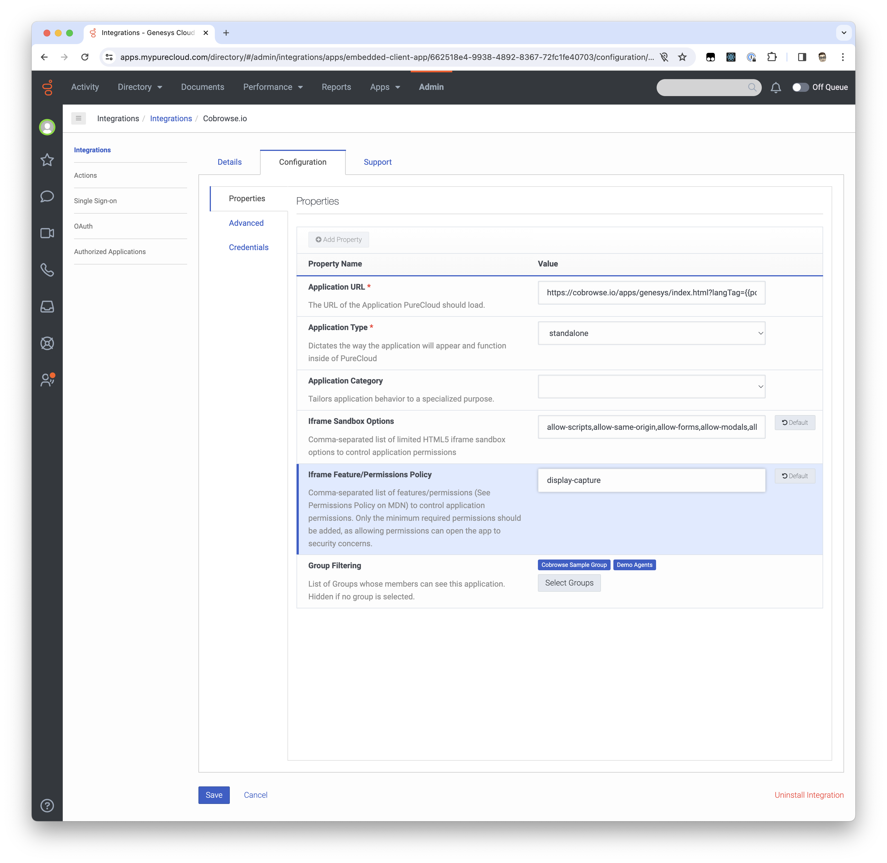

# Genesys Cloud

The Cobrowse.io integration for Genesys Cloud may be installed from the App Foundry as a Premium App.

AppFoundry listing: [https://appfoundry.genesys.com/filter/genesyscloud/listing/af9a5848-07fd-4021-bce0-663c02970566](https://appfoundry.genesys.com/filter/genesyscloud/listing/af9a5848-07fd-4021-bce0-663c02970566)

Demo video: [https://vimeo.com/919780454](https://vimeo.com/919780454).

## Installing the apps

In total, there are two separate apps to install:

* Cobrowse.io (Standalone App) - installed as usual via AppFoundry.&#x20;
* Cobrowse.io (Interaction) Widget - installed after the Standalone app. Go to Genesys Cloud at Admin -> Integrations -> + Integrations (shown below) and search for Cobrowse.io, selecting the Widget app.

<figure><figcaption></figcaption></figure>

For each Premium App, please activate it.

For information on what is different between these apps, see this article - [https://support.cobrowse.io/genesys-cloud-standalone-and-widget-apps](https://support.cobrowse.io/genesys-cloud-standalone-and-widget-apps)

## Controlling access

Under Configuration you can select which Groups will have access to each app. Regular agents usually only require access to the Widget app. Supervisors and Administrators might require access to both apps, or just the Standalone app.


**Roles**: the Cobrowse.io apps will create two additional roles, one for Agents and one for Administrators. Please see this article for more information: [https://support.cobrowse.io/genesys-user-roles](https://support.cobrowse.io/genesys-user-roles)

**Group** configuration: Groups can be configured to automatically assign Roles, so you may wish to control access based on Groups which use the default Cobrowse.io Roles. Group access must be configured in order for the apps to appear.&#x20;


### Widget app queue filtering

For the Cobrowse.io Interaction Widget, you can also specify the Queue Filtering. This will determine which agent queues the Widget app should appear for, **in addition to** any other filtering you have configured, e.g. Groups, Communication type, etc. Leaving this blank will mean no additional filtering is performed by queue.&#x20;

### Widget app communication filtering

For the Cobrowse.io Interaction Widget, you can also specify the Communication Type Filtering, e.g. `chat,call,callback,email,sms,line,facebook,twitter,whatsapp`. This will determine which communication types the Widget app should appear for, **in addition to** any other filtering you have configured, e.g. Groups, Queues, etc. Leaving this blank will mean no additional filtering is performed by communication type.&#x20;

Possible communication types can be found in the Genesys docs: [https://developer.genesys.cloud/routing/routing/available-media-types](https://developer.genesys.cloud/routing/routing/available-media-types). Note that for Message, you only need to list the subtype name, e.g. `open`.

## Self-hosted instances

Please email us at [hello@cobrowse.io](mailto:hello@cobrowse.io) before switching to your self-hosted instance.&#x20;

If you are [self-hosting](../../../enterprise-self-hosting/self-hosting-overview.md) the Cobrowse.io instance, you will need to replace "`cobrowse.io`" in both Application URLs with your self-hosted domain, e.g. `https://<your self-hosted domain>/apps/genesys/index.html?langTag={{pcLangTag}}&environment={{pcEnvironment}}&env=cloud`

## Agent Present Mode

If you wish to present the Agent's desktop from within Genesys Cloud you need to add `display-capture` to the **Iframe Feature/Permissions Policy** configuration within the Cobrowse Integration. Without this you won't be able to share the agents desktop.&#x20;

<figure><figcaption></figcaption></figure>

## Troubleshooting

### Cobrowse.io Roles not appearing?

Sometimes the Cobrowse.io default Roles might not appear immediately after app installation. This issue resolves itself after logging in and out, and if not, then after some time has passed. Please check again after a couple of business days. If the roles still do not appear then please contact us here: [https://cobrowse.io/support-request](https://cobrowse.io/support-request).

### Cobrowse.io Interaction Widget not appearing?

Confirm that the Cobrowse.io Widget within the “Integrations” page within the Genesys Cloud account Admin space. The app should be installable there.

If not then it should also be available to install in the marketplace in the same location:

If the Widget app is still not appearing, then please check your Role, Group, Queue, and Communication Type filtering configuration for the Widget app. If you are testing in non-production, then removing any Queue and Communication filtering can help to see if the issue lies with this.&#x20;
