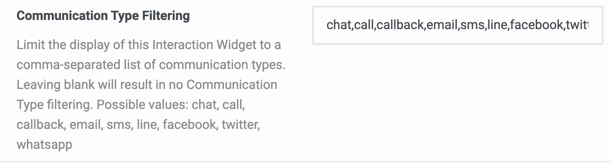

# Genesys Cloud

The Cobrowse.io integration for Genesys Cloud may be installed directly from the App Foundry as a Premium App. There are two separate Premium Apps to install:

* Cobrowse.io Standalone App
* Cobrowse.io Interaction Widget

For each Premium App, please activate it, and under Configuration you can select which Groups and Queues will have access to it.&#x20;

For the Cobrowse.io Interaction Widget, you will also need to specify the Communication Type Filtering, eg. `chat,call,callback,email,sms,line,facebook,twitter,whatsapp`

App Foundry link - [https://appfoundry.genesys.com/filter/genesyscloud/listing/af9a5848-07fd-4021-bce0-663c02970566](https://appfoundry.genesys.com/filter/genesyscloud/listing/af9a5848-07fd-4021-bce0-663c02970566)

Demo video - [https://www.youtube.com/watch?v=vd8A4\_JrpLs](https://www.youtube.com/watch?v=vd8A4\_JrpLs)

Knowledge article - [https://support.cobrowse.io/genesys-cloud-standalone-and-widget-apps](https://support.cobrowse.io/genesys-cloud-standalone-and-widget-apps)

### Self-hosted instances

Please email us at [hello@cobrowse.io](mailto:hello@cobrowse.io) before switching to your self-hosted instance.&#x20;

If you are [self-hosting](../../../enterprise-self-hosting/self-hosting-overview.md) the Cobrowse.io instance, you will need to replace "cobrowse.io" in both Application URLs with your self-hosted domain, e.g. https://\<your self-hosted domain>/apps/genesys/index.html?langTag=\{{pcLangTag\}}\&environment=\{{pcEnvironment\}}\&env=cloud

