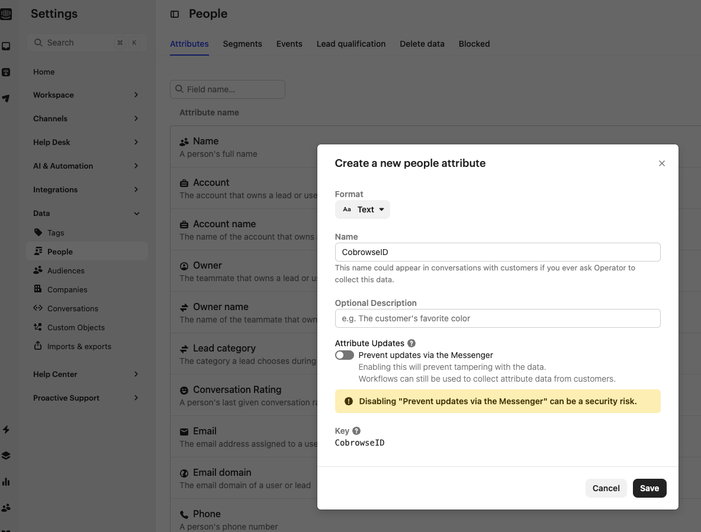
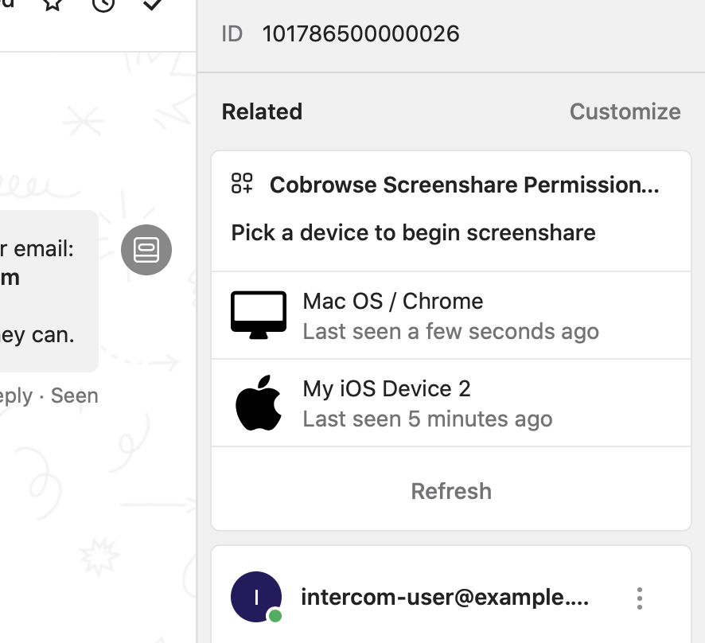

# Intercom

## Overview

Cobrowse.io provides an integration with Intercom available in the [Intercom App Store](https://www.intercom.com/app-store/?app_package_code=cobrowse-screenshare-permissions).


Cobrwse for Intercom


## Install the app

Install the app from the [Intercom App Store](https://www.intercom.com/app-store/?app_package_code=cobrowse-screenshare-permissions) and follow the setup instructions!

## Add our SDKs to get started!

See [Getting started](../../) to add our SDKs and begin end-to-end testing! Your license key can be found in your Account Settings, seen above.

## Voice and Video Support

Cobrowse sessions work nicely along the [Intercom Calling](https://www.intercom.com/phone) feature that adds support for voice and video.

To enable the Calling feature go to your Settings>Calling page in [https://app.intercom.com/a/apps/\_/settings/calling](https://app.intercom.com/a/apps/_/settings/calling).

## Troubleshooting

#### I can connect from https://cobrowse.io/dashboard, but not from within Intercom.

It's likely your Intercom account is linked to a separate Cobrowse.io account. When you install Cobrowse.io for Intercom, a new license key is generated for you. This may be different from an existing license key you are using when you signed up directly at [https://cobrowse.io/register](https://cobrowse.io/register).

#### No devices found for user, cannot start cobrowse session.

Please ensure a Cobrowse.io SDK has been added to the platform where you are using Intercom chat. Installation instructions for each SDK are found at [Getting Started](../../).

New Intercom accounts prevent updating custom attributes via Messenger by default, which may hinder the functionality of the smart connect feature. To resolve this, navigate to your Intercom account settings: **Settings > Data > People**. If a **CobrowseID** custom attribute does not exist, create it and ensure the "Prevent updates via the Messenger" toggle is turned off.

#### Agent is stuck on "waiting for authorization".

We are aware of a possible issue with React Native apps only, where the user consent prompt is hidden behind the Intercom SDK's UI, so it is not visible for the user to take action. To confirm this is what is happening, you can disable "Require user consent" from [https://cobrowse.io/dashboard/settings](https://cobrowse.io/dashboard/settings) and try to start a new session via Intercom.

#### Sorry, you do not have permissions to modify this app installation.

Intercom requires users to have the "Can install, configure and delete apps" permission in order to "Login with Intercom", and therefore also the Cobrowse.io Messenger App. You may grant your users this permission in Settings -> General -> Teammates -> Edit.

To work around this problem, we have released the Cobrowse.io Inbox App, which lives in the sidebar of Intercom, and enables connecting to the end-user's device(s) with just one click.

