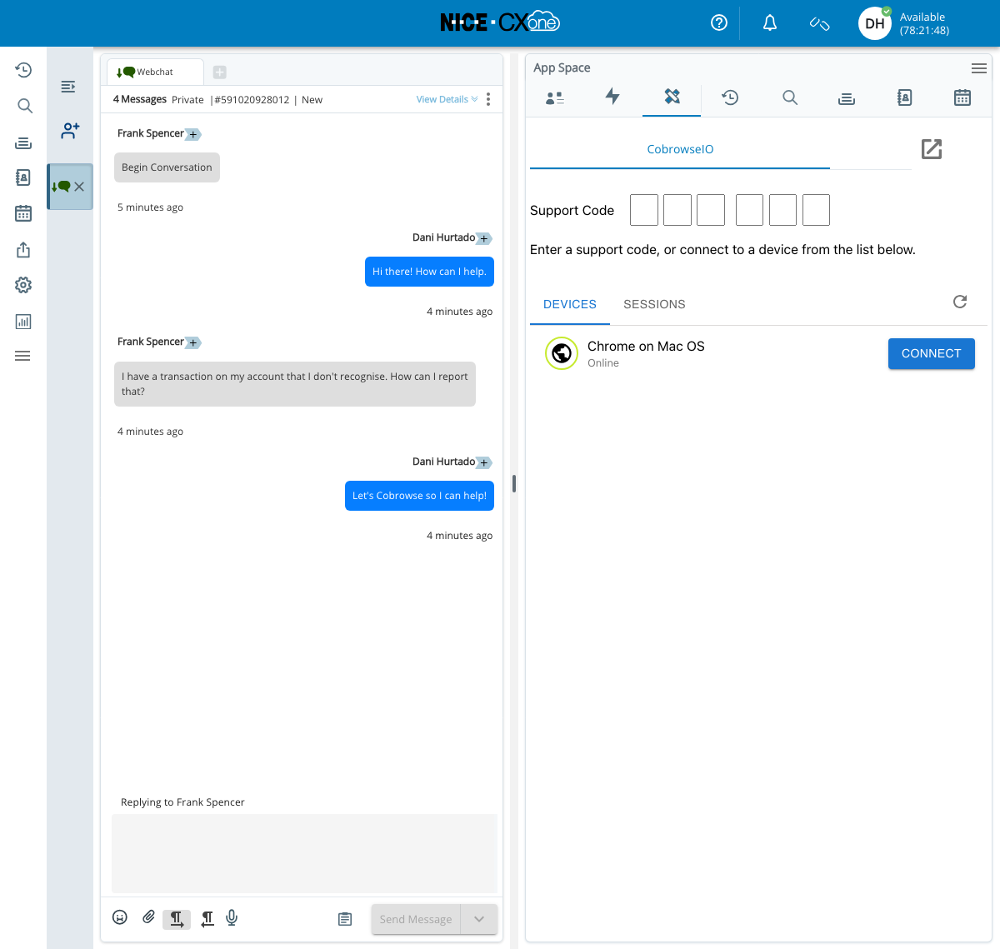

# NICE

## Overview

Cobrowse.io is available as an integration for NICE CXOne in the [NICE CXexchange](https://cxexchange.niceincontact.com/en-US/apps/465658/cobrowseio).

<figure><figcaption></figcaption></figure>

## Install Digital and Phone Support

The Cobrowse.io can be added to your Digital and Phone workflows so that agents can start a Cobrowse session from the context of an interaction.&#x20;

Please contact us at [hello@cobrowse.io](mailto:hello@cobrowse.io) and we will assist you setting up CXOne Studio with Cobrowse.io.


Cobrowse.io for NiceCX


## Add our SDKs to get started!

See [Getting started](../../) to add our SDKs and begin end-to-end testing! Your license key can be found in the Cobrowse.io dashboard Account Settings. To access it click the 'Launch' icon in the sidebar.

<figure><figcaption>
Cobrowse.io for CXOne in action
</figcaption></figure>

