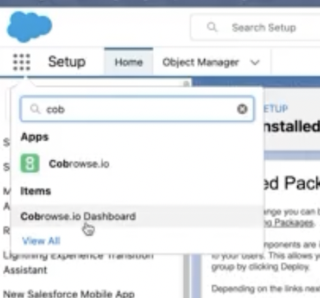
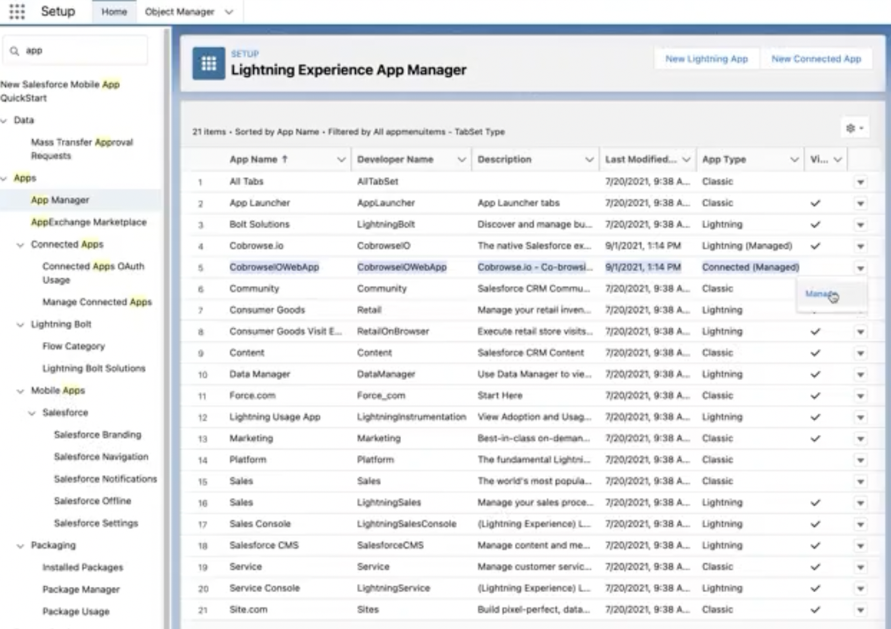
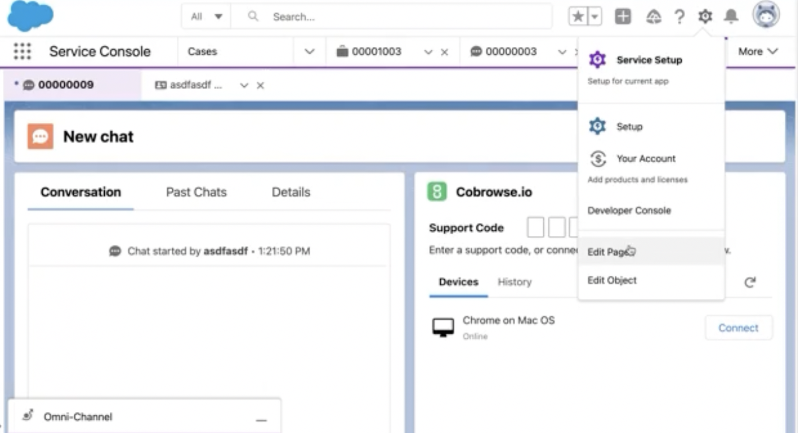
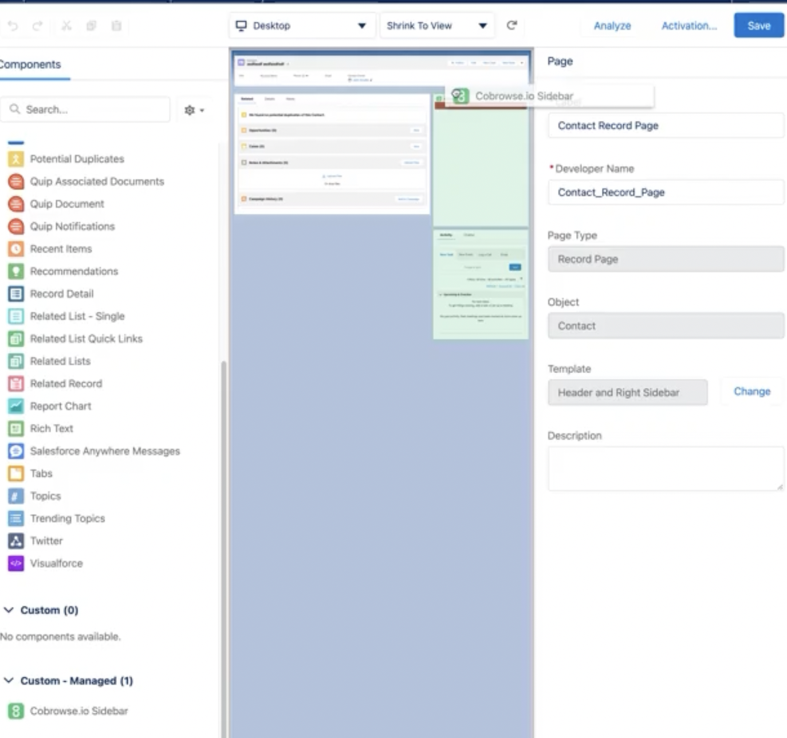

# Salesforce

## Overview

The new version of our Salesforce integration is now available. System admins can follow the steps below in order to give your organization access to Cobrowse.io within Salesforce.

## Uninstall Salesforce legacy

Uninstall our Salesforce legacy integration if it is already installed. Within Salesforce, go to Setup and search for "packages" in the left-hand search bar. Select "Installed Packages".

Select Uninstall next to the CobrowseIO application, and this will take you to the uninstall page for the Salesforce legacy application.

The page will display all of the Cobrowse.io Metadata Components and Custom Object Data that will be uninstalled. You may choose to save the deleted package data or not \(it is not required\) by checking the appropriate boxes.

**Note: your session history, recordings, audit trial etc. will not be deleted with either option above. It will always be preserved and viewable within the new app.**

Check the final box to confirm that the app will be uninstalled and click Uninstall, as shown below.

The uninstall process will take a few minutes before it is completed and you may also be prompted to remove components from individual pages. Removing these components is mandatory for the uninstall.

## Install the new app

You will be provided with an installation link that will perform the install of the new integration. Click the link and log in to Salesforce when prompted. Select Install for All Users at the install page.

This will allow all users to access the application after permissions have been granted within Salesforce \(as shown later\). The install process will take a few minutes.

Verify that the app has been installed by searching for Cobrowse.io in the App Launcher search bar.

Click on either option and the below screen should appear.

This is expected and verifies that the application has been installed correctly. The next step is to give appropriate access to the users in your organisation \(including admins\).

## Grant access to Users

Go to Setup and search for App Manager. Select Manage for the CobrowseIOWebApp as shown below.

Select Edit Policies and change Permitted Users to "Admin Approved users are pre-authorized" and then Save.

Next select Manage Profiles from the Profiles section of the Manage page display. 

Within the Manage Profiles options select System Administrator and Standard User then Save. 

Search Cobrowse.io in the App Launcher search bar again and go back to the dashboard by selecting either option.

The Cobrowse.io dashboard should now be visible to both administrators and support agents. Account settings from the previous integration will have been preserved.

## Sidebar widget placement

You can also add the Cobrowse.io widget to your record pages for Cases, Contacts, Accounts, or any other record pages accessible via Sales Console, Service Console, or otherwise. To do this, navigate to the  page you would like to add the widget to and click the settings button in the top right to "Edit Page".

You can then drag and drop the Cobrowse.io Sidebar managed component \(from Custom - Managed on the left\) into the location of your choice.

The sidebar widget should then be displayed in all of the pages that it has been added to.

## Filtering devices using Salesforce Record metadata \(optional\)

This step is optional for clients who wish to override the default device filtering in the Cobrowse.io Sidebar widget. For example in Cases and Contacts, by default the sidebar widget will filter by devices that match the end user's email address.

In Salesforce legacy, this filtering was provided in the Cobrowse.io Settings tab. It is now located within the Cobrowse.io Dashboard. Go to Cobrowse.io Dashboard \(e.g. via App Launcher search\) then Account Settings \(Admins only\), then Integrations, then Salesforce record Mapping. 

The first argument specifies the page for the filtering to be applied to, e.g. "Case". Then the key:value pair specifies the SalesforceMetadata:Cobrowse.ioCustomData that should be mapped together, linking the Salesforce metadata from a page to the corresponding Cobrowse.io custom data field to filter the devices.

In the example above \(and by default\), "ContactEmail" in Salesforce is mapped to "user\_email" in Cobrowse.io custom data. This means that "ContactEmail" filters the devices shown on the "Case" pages.

See [https://docs.cobrowse.io/sdk-features/identify-your-devices](https://docs.cobrowse.io/sdk-features/identify-your-devices) for more information on using Cobrowse.io custom data to identify your devices.

If you have any questions about the above steps then please get in touch at [support@cobrowse.io](mailto:support@cobrowse.io)!

## Troubleshooting

### Granting multiple users Cobrowse.io Admin role permissions

As part of the install, you may need to grant multiple users the Admin role permissions within Cobrowse.io, e.g. so that they can see all agents' session history. This should happen automatically, but if it does not work then it can also be done manually.

Simply go the User's profile within Salesforce via Setup then Users and Users again. Select the User and inspect their Permission Set Assignments. Edit Assignments and add the Cobrowse.io Admin permission set to their profile. They will then have Cobrowse.io Admin rights which can be verified in the Cobrowse.io Dashboard.

