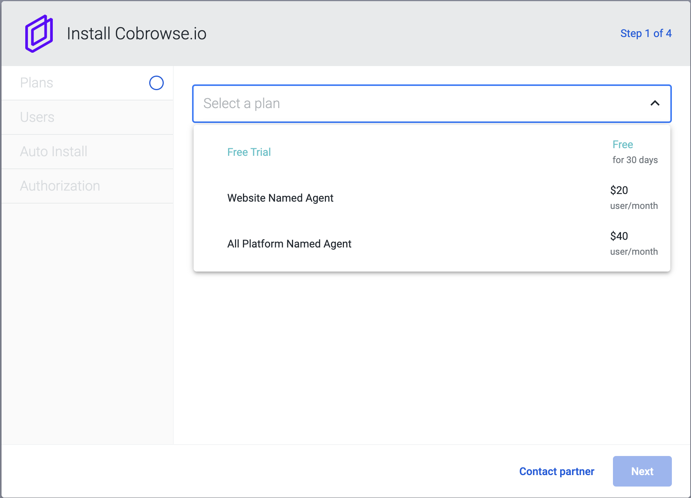
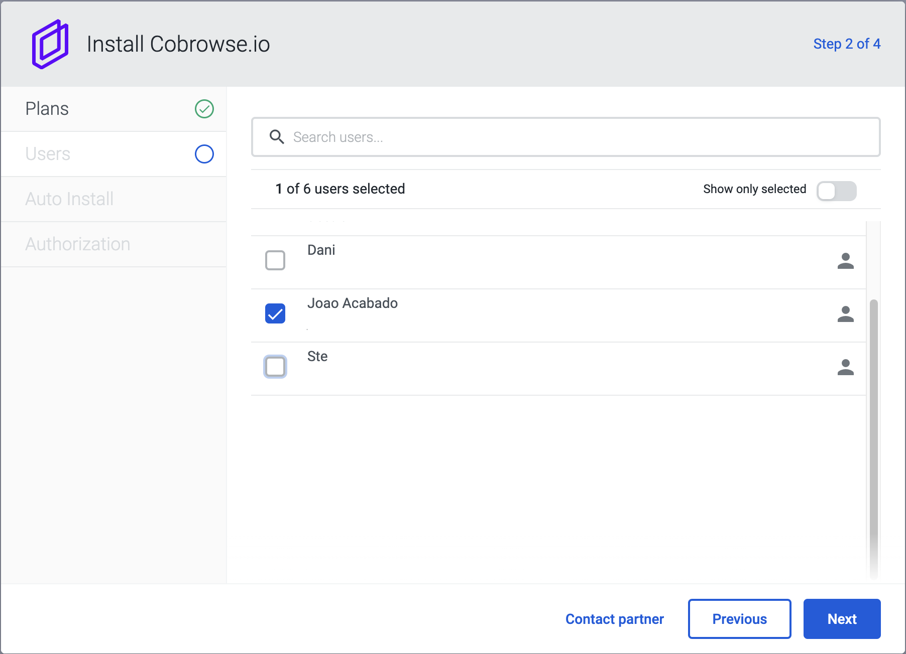
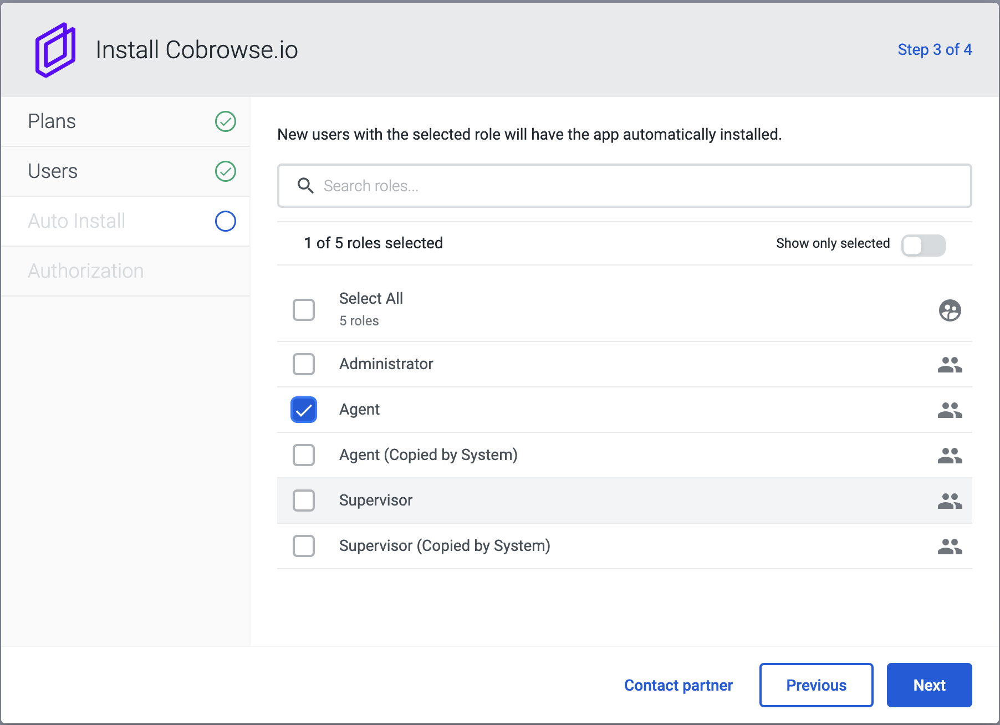
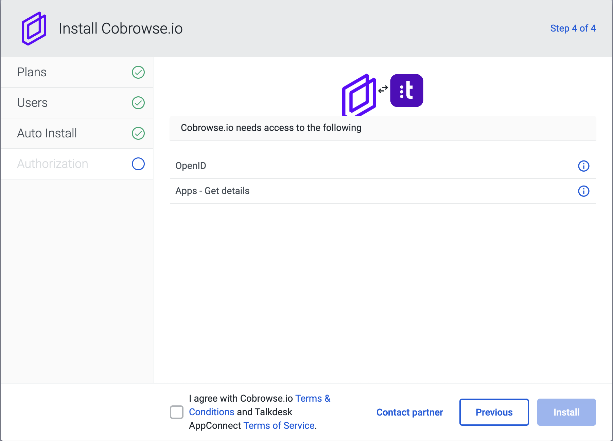
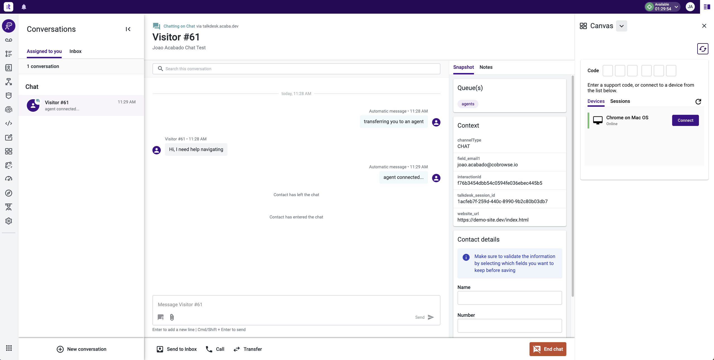

# Talkdesk

## Overview

The Cobrowse.io is available for installation in Talkdesk AppConnect.

## Installation Instructions

You only need to have a Talkdesk account and you can install the [Cobrowse.io](http://cobrowse.io) integration app directly from AppConnect.

During the installation you will go through the following steps:

1.  Choose your plan: Trial, Website or All Platform\

    <figure><figcaption></figcaption></figure>
2.  Choose which users will have access to Cobrowse.io\

    <figure><figcaption></figcaption></figure>
3.  Provide access base on role for future users\

    <figure><figcaption></figcaption></figure>
4.  Review terms and permissions to finish the installation\

    <figure><figcaption></figcaption></figure>

When installation completes the Cobrowse.io app will be available from the launch pad in the bottom-left corner.

See [Getting started](../../) to add our SDKs and begin end-to-end testing! Your license key can be found in your Account Settings, seen above.

<figure><figcaption></figcaption></figure>

### Managing your Account

You can manage your pricing plan and the users that have access to the Cobrowse.io app from Talkdesk following the instructions in [https://support.talkdesk.com/hc/en-us/articles/115005879543-AppConnect-User-Management-and-Self-service-Expansions](https://support.talkdesk.com/hc/en-us/articles/115005879543-AppConnect-User-Management-and-Self-service-Expansions).

### Cobrowse.io Sidebar

For quicker access it's also possible to use the Cobrowse.io app from the secondary area canvas as in the screenshot below.

<figure><figcaption></figcaption></figure>

Please reach out to us [hello@cobrowse.io](mailto:hello@cobrowse.io) so we provide you with the Workspace Designer assets to add to your Talkdesk account.

