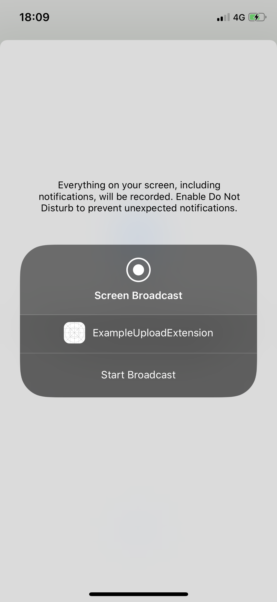

# Full device capabilities

### Overview

The Cobrowse.io SDK for Android will allow full device screen capture, including home screen, device settings, and everything else, just by toggling "full device mode" during an active session. There's no changes in the Android SDK required to support this. If you do not want this feature, you may completely disable "Full Device Viewing" in your account settings. 

On Android, you can also enable full device remote control, including optional unattended access, but this requires enabling the Accessibility Service when integrating the Android SDK. Please follow the directions below. 

The Cobrowse.io SDK for iOS allows full device screen capture, but this requires enabling the Broadcast Extension when integrating the iOS SDK. Please follow the directions below. 



The Cobrowse.io SDK for Web includes an optional "full device" toggle in the bottom right when running an active session. This feature enables the end-user to share their entire screen on their laptop or desktop. This is great if the end-user navigates to browser tabs outside of your website, where the Web SDK's JavaScript snippet is not installed, or if the end-user needs to share a PDF, or their entire desktop. 

_Note that redaction, annotation, and remote control are disabled when in full device mode via our Web SDK. If you require full desktop redaction, annotation, and remote control, please see our_ [_MacOS_](../sdk-installation/macos.md) _and_ [_Windows_](../sdk-installation/windows.md) _SDKs, which will require a downloaded utility on the end-user's computer._

To customize the UI of the full device consent prompt on Web:

```javascript
CobrowseIO.confirmFullDevice = function() {
    return new Promise(function(resolve, reject) {
        // your logic here
        // call CobrowseIO.currentSession.fullDevice() to get current full device state
        // call resolve() to start full device, or reject() to turn off full device
    });
}
```



Follow this guide to add the Broadcast Extension required for capturing full device frames.

### Implementation

**Add a Broadcast Extension target**

1. Open your Xcode project
2. Navigate to File &gt; New &gt; Target...
3. Pick "Broadcast Upload Extension"
4. Enter a name for the target
5. Uncheck "Include UI Extension"
6. Create the target, noting its bundle ID
7. Change the target SDK of your Broadcast Extension to iOS 12.0 or higher _\(Note: it should still work as far back to iOS 10.0\)_

**Set up Keychain Sharing**

Your app and the app extension you created above need to share some secrets via the iOS Keychain. They do this using their own Keychain group so they are isolated from the rest of your apps Keychain.

In **both** your **app target** and your **extension target** add a Keychain Sharing entitlement for the "io.cobrowse" keychain group.

**Add the bundle ID to your plist**

Take the bundle ID of the **extension** you created above, and add the following entry in your apps `Info.plist` \(_Note:_ **not** in the extensions `Info.plist`\), replacing the bundle ID below with your own:

```markup
<key>CBIOBroadcastExtension</key>
<string>your.app.extension.bundle.ID.here</string>
```

**Add the new target to your Podfile**

The app extension needs a dependency on the CobrowseIO app extension framework. Add the following to your Podfile, replacing the target name with you own extensions target name:

```ruby
target 'YourExtensionTargetName' do
    pod 'CobrowseIO/Extension', '~>2'
end
```

_Make sure to run `pod install` after updating your Podfile_

**Implement the extension**

Xcode will have added `SampleHandler.m` and `SampleHandler.h` \(or `SampleHander.swift`\) files as part of the target you created earlier. Replace the content of the files with the following:

### Swift

```swift
import CobrowseIOAppExtension

class SampleHandler: CobrowseIOReplayKitExtension {

}
```

### Objective C

```objectivec
// SampleHandler.h

@import CobrowseIOAppExtension;

@interface SampleHandler : CobrowseIOReplayKitExtension

@end
```

```objectivec
// SampleHandler.m

#import "SampleHandler.h"

@implementation SampleHandler

@end
```

**Build and run your app**

You're now ready to build and run your app. The full device capability is only available on physical devices, it will not work in the iOS Simulator.

If you've set everything up properly, after clicking the blue circular icon you should see the following screen to select your Broadcast Extension. 



### Troubleshooting

If full device screen capture on iOS is not working, please check the following:

* Please verify you are testing on a physical device, and not the iOS simulator.
* Please verify you have added the Bundle Id of your Broadcast Extension to your main app's Info.plist as described in our documentation. If you have not, then no options will appear in the list after clicking the blue circular record button. 
* Please verify you are not running any other screen recording or screen mirroring software at the same time, as this will interfere. 



Full device screen capture for Android is supported out of box with our Android SDK, and does not require any extra development or configuration. 

Full device remote control for Android, including unattended access, is officially supported starting in our v2.0 release. It uses an Accessibility Service that must be enabled on the device to grant access.

This feature is supported in API 21 \(5.0 Lollipop\) and above.

### Implementation

Add the following line to one of your resources xml files, eg. in `res/values/bools.xml`:

```markup
<?xml version="1.0" encoding="utf-8"?>
<resources>
    <bool name="cobrowse_enable_full_device_control">true</bool>
</resources>
```

_Note: Please add this value to a Values resource file, and not an XML resource file._

Enable the accessibility service the Cobrowse SDK will have added in the main device settings, eg. Settings -&gt; Accessibility -&gt; Your App Name. Note: this only has to be done the very first time.

We also have built some logic to detect if accessibility service is running, and if not, to deep link the user to the settings to enable it.

Show the sample UI with:

```java
CobrowseAccessibilityService.showSetup(...);
```

Check if accessibility service is already running with:

```java
CobrowseAccessibilityService.isRunning(...);
```

Deep link user to accessibility settings with:

```java
Intent intent = new Intent(android.provider.Settings.ACTION_ACCESSIBILITY_SETTINGS);
intent.addFlags(Intent.FLAG_ACTIVITY_NEW_TASK);
startActivity(intent);
```

### Notes for unattended access

For unattended full device access, we strongly recommend:

* Please initiate sessions with push notifications, rather than our default sockets. This will enable unattended access, even when your app has been backgrounded a long time, or force closed. More info at [Initiate sessions with push](initiate-sessions-with-push.md).
* Please turn off "Require User Consent" prompts at [https://cobrowse.io/dashboard/settings](https://cobrowse.io/dashboard/settings). Otherwise, a user must always accept the consent prompt on the device before a session can start.
* Be wary of battery optimization policies. On some devices you may need to add your app to a battery optimization whitelist to prevent it from killing the push notifications. More info here: [https://dontkillmyapp.com/](https://dontkillmyapp.com/)

### Troubleshooting

* If the screen is black during full device screen capture, please make sure your views are not marked as secure. More info here: [https://developer.android.com/reference/android/view/WindowManager.LayoutParams\#FLAG\_SECURE](https://developer.android.com/reference/android/view/WindowManager.LayoutParams#FLAG_SECURE)
* If you are using Android Enterprise, please ensure your enterprise settings do not disallow screen capture.
* If you get `compile error android:foregroundServiceType not found`, please update your Android project to use `compileSdkVersion 29`. 




Please follow the iOS and Android documentation to implement full device capabilities on React Native.

Any questions, please [email us](mailto:hello@cobrowse.io). 


### Troubleshooting

* For React Native on iOS, some clients have reported that Xcode does not automatically create the _{{extensionname}}.entitlements_ file in the extension directory, which is necessary for the "io.cobrowse" keychain sharing to work. 




Please review the iOS documentation for full device capabilities first. 

This documentation specific to Xamarin.iOS is supplementary, and covers the differences only. 


**Add a Broadcast Extension project**

In Visual Studio for Mac:

1. Open your Xamarin solution
2. Right click on the solution, select Add &gt; New Project...
3. Navigate iOS &gt; Extension
4. Pick "Broadcast Upload Extension"
5. Enter a name for the target, e.g. `YourApp.iOS.BroadcastUploadExtension`
6. Select your iOS app to add the extension to
7. Create the location for the extension and press "Create"
8. Visual Studio for Mac will create two extension projects for you: `YourApp.iOS.BroadcastUploadExtension` and `YourApp.iOS.BroadcastUploadExtensionUI`. The second project is not required and you can safely delete it.
9. Change the target SDK of your Broadcast Extension target to at least iOS 10.0

**Set up Keychain Sharing**

Your app and the app extension you created above need to share some secrets via the iOS Keychain. They do this using their own Keychain group so they are isolated from the rest of your apps Keychain.

In **both** your **iOS app** and your **extension project** add a Keychain Sharing entitlement for the "io.cobrowse" keychain group.

**Add the bundle ID to your plist**

Take the bundle ID of the **extension** you created above, and add the following entry in your apps `Info.plist` \(_Note:_ **not** in the extensions `Info.plist`\), replacing the bundle ID below with your own:

```markup
<key>CBIOBroadcastExtension</key>
<string>your.app.extension.bundle.ID.here</string>
```

**Add the Cobrowse.io AppExtension NuGet**

The app extension needs a dependency on the CobrowseIO app extension framework. Add the following NuGet to the **extension project** \(not to the iOS app project\):

* [](https://www.nuget.org/packages/CobrowseIO.AppExtension.iOS/)

**Implement the extension**

Visual Studio will have added `SampleHandler.cs` file as part of the extension project you created earlier. Replace the content of the file with the following:

```csharp
using Xamarin.CobrowseIO.AppExtension;

[Register("SampleHandler")]
public class SampleHandler : CobrowseIOReplayKitExtension
{
    protected SampleHandler(IntPtr handle) : base(handle)
    {
    }
}
```

**Make sure Info.plist points to the correct class**

Open Info.plist of the extension project and make sure that `NSExtension` section looks like this:

```markup
<plist version="1.0">
<dict>
    ...
    <key>NSExtension</key>
    <dict>
        <key>NSExtensionPointIdentifier</key>
        <string>com.apple.broadcast-services-upload</string>
        <key>NSExtensionPrincipalClass</key>
        <string>SampleHandler</string>
        <key>RPBroadcastProcessMode</key>
        <string>RPBroadcastProcessModeSampleBuffer</string>
    </dict>
</dict>
</plist>
```




Please review the Android documentation for full device capabilities first. 

This documentation specific to Xamarin.Android is supplementary, and covers the differences only. 


When adding the Full Device Control flag from the Android documentation, please add this value to a file with Build Action set to `AndroidResource`, and not to an XML resource file.

Show the sample UI with:

```csharp
CobrowseAccessibilityService.ShowSetup(...)
```

Check if accessibility service is already running with:

```csharp
CobrowseAccessibilityService.IsRunning(...)
```

Deep link user to accessibility settings with:

```csharp
Intent intent = new Intent(global::Android.Provider.Settings.ActionAccessibilitySettings);
intent.AddFlags(ActivityFlags.NewTask);
StartActivity(intent);
```




