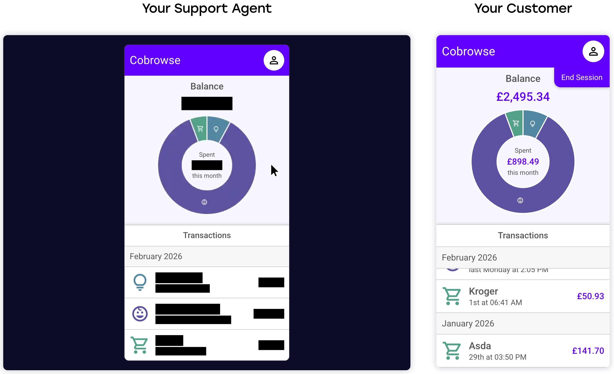

# Redact sensitive data

Within your applications you might show or input sensitive data such as credit card or social security numbers. With redaction you can configure anything so it is not seen by the agent.


Anything that is redacted never leaves the users device and is never seen by the agent.


<figure><figcaption>
Agent can not see redacted content
</figcaption></figure>

### Redaction modes

#### Default redaction

In this mode you tell the SDK what must **not** be seen by the agent. This can be seen as a block list of views / elements that must **not** be show to the agent and must **not** be processed.

#### Private by Default

Private by default is a more strict mode where by default everything is redacted from the agent and views / elements must be configured to be seen or **unredacted**. This can be seen as an allow list of views / elements that can be seen by the agent, ensuring anything else will **not** be shown to the agent.

### Ways to configure redaction

#### Define redaction in your source code

By defining redaction within your application's source code you tie a redaction configuration to that version. This can be useful for mobile applications that are submitted to App Stores ensuring as new versions are submitted, redaction remains as applied in older versions.

#### Define redaction via the web dashboard

Redaction & unredaction can also be configured via our web dashboard.

[https://cobrowse.io/dashboard/settings/redaction](https://cobrowse.io/dashboard/settings/redaction)

Adding selectors via the dashboard can be useful if your application is already in production and you need to redact a view / element retrospectively, either due to a missed redaction entry or changing of requirements.

### Configuring redaction

Please follow the specific documentation for your platform:


[web.md](web.md)



[ios.md](ios.md)



[android.md](android.md)



[react-native.md](react-native.md)



[flutter.md](flutter.md)



[.net-maui.md](.net-maui.md)

