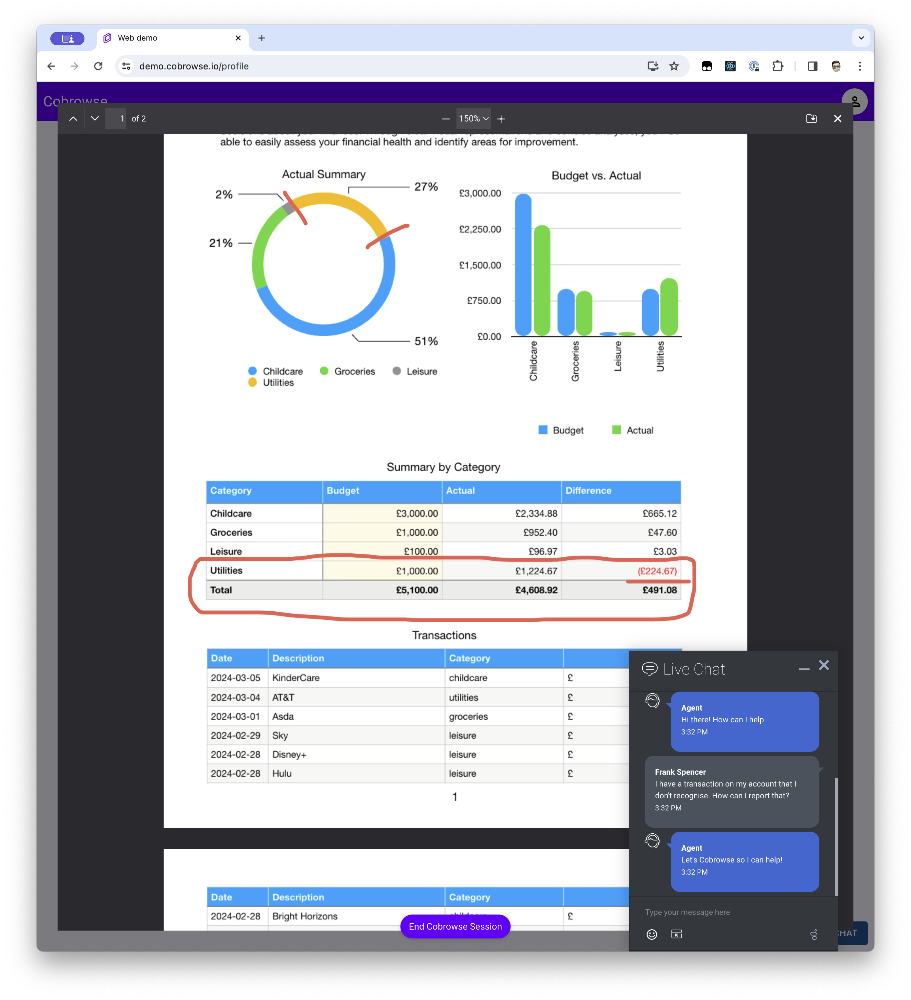

# Viewing PDFs

If you offer PDF documents on your website and want to include them in your Cobrowse sessions you just need to enable the PDF viewing feature on the Cobrowse SDK.

<figure><figcaption></figcaption></figure>

With this feature enabled an embedded viewer will load the documents directly into the browser without requiring downloads or the full device mode.

## Configuration&#x20;

The PDF Viewer functionality is configured with URLs of the PDFs as they are linked on your website. To make it simpler to configure this be done using [glob patterns](https://www.npmjs.com/package/glob-to-regexp#usage) with which you can use to match different patterns:

```javascript
// links in your website ending with the .pdf extension
CobrowseIO.pdfLinks = ['*.pdf']

// links to the example.com domain with the path starting with /assets/pdfs/
CobrowseIO.pdfLinks = ['https://example.com/assets/pdfs/*']

// links to any domain with /pdfs/ as part of the path and the .pdf extension
CobrowseIO.pdfLinks = ['*/pdfs/*.pdf']
```

the same can be achieved using [Javascript RegExp](https://developer.mozilla.org/en-US/docs/Web/JavaScript/Reference/Global\_Objects/RegExp):

```javascript
// links in your website ending with the .pdf extension
CobrowseIO.pdfLinks = [/.*\.pdf/]

// links to the example.com domain with the path starting with /assets/pdfs/
CobrowseIO.pdfLinks = [/https\:\/\/example\.com\/assets\/pdfs\/.*\.pdf/]

// links to any domain with /pdfs/ as part of the path and the .pdf extension
CobrowseIO.pdfLinks = [/.*\/pdfs\/.*\.pdf/]
```

The `pdfLinks` property is an array which will accept either of these formats.


